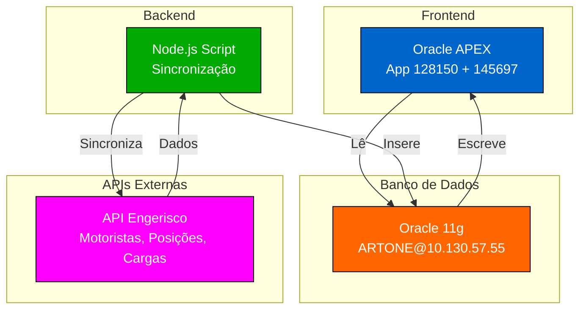
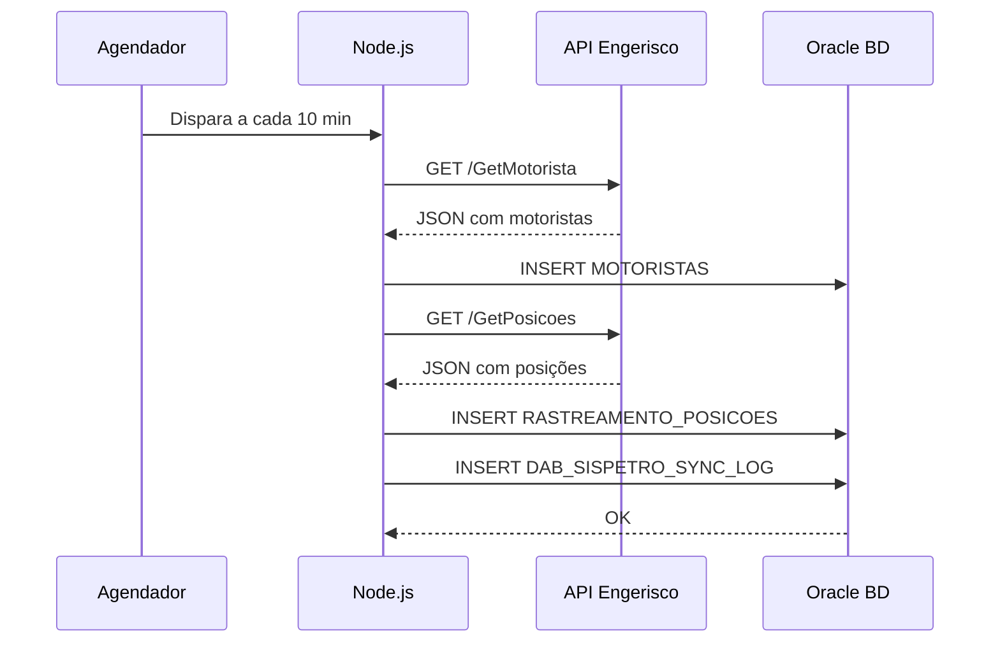
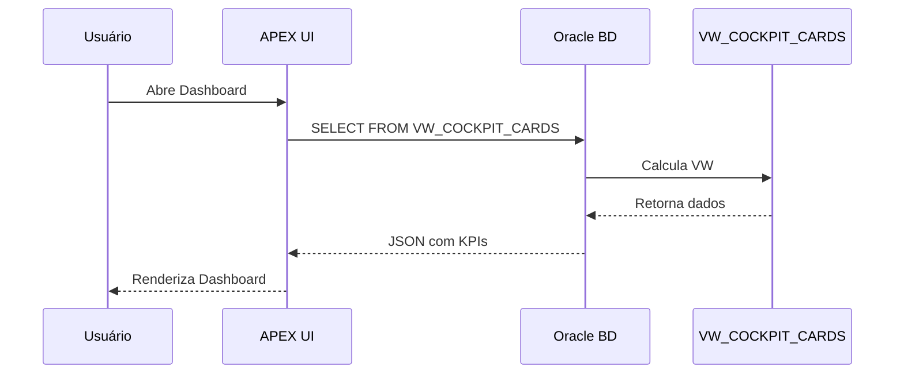

# 🏗️ Arquitetura - ArtPetro Cockpit

Documento de arquitetura técnica do sistema ArtPetro.

---

## 📊 Diagrama Geral



---

## 🏛️ Camadas

### 1️⃣ Camada de Apresentação (Frontend)

**Oracle APEX**
- 📱 Interface web responsiva
- 🎨 Dashboards e KPIs
- 📋 Formulários de cadastro
- 🔐 Autenticação integrada ao BD

**Apps:**
- App 128150: Cockpit de Logística
- App 145697: Cadastro de Usuários

---

### 2️⃣ Camada de Aplicação (Backend)

**Node.js + Axios**
- 🔄 Sincronização com API Engerisco
- ⏰ Agendamento automático (10 min)
- 🐛 Tratamento robusto de erros
- 📝 Logging em BD

**Responsabilidades:**
- Conectar com API Engerisco
- Transformar dados
- Validar integridade
- Registrar logs

---

### 3️⃣ Camada de Dados (Banco de Dados)

**Oracle Database 11g**
- 🗄️ Armazenamento central
- 📊 Dados estruturados
- 🔒 Segurança nativa
- ⚡ Performance

**Tabelas Principais:**
- `MOTORISTAS` - Dados de motoristas
- `VEICULOS` - Dados de veículos
- `RASTREAMENTO_POSICOES` - GPS em tempo real
- `PROGRAMACAO_CARGAS` - Ordens de carregamento
- `DAB_SISPETRO_SYNC_LOG` - Auditoria de sincronização

**Views (BI/Dashboard):**
- `VW_COCKPIT_CARDS` - KPIs para dashboard
- `VW_KANBAN_OCS` - Status de ordens
- `VW_JORNADA_CARGA` - Rastreamento completo
- `VW_ALERTAS_CRITICOS` - Alertas automáticos

---

### 4️⃣ Camada de Integração (APIs Externas)

**API Engerisco**
- 📍 GetPosicoes - Rastreamento GPS
- 👤 GetMotorista - Dados de motoristas
- 📦 GetProgramacaoCargas - Ordens de carregamento

---

## 🔄 Fluxos de Dados

### Fluxo de Sincronização



### Fluxo de Visualização



---

## 📈 Componentes Críticos

### Script de Sincronização

**Arquivo:** `scripts/sincroniza-engerisco/sincroniza-engerisco-v4.4-agendado.js`

**Características:**
- ✅ Suporta modo teste (uma-vez) e produção (agendado)
- ✅ Tratamento de erros com retry
- ✅ Logging completo em BD
- ✅ Timeout de 30s por request
- ✅ Suporte a SSL/TLS nativo

**Dependências:**
```json
{
  "oracledb": "^7.0.1",  // Driver Oracle
  "axios": "^1.6.0",     // HTTP client
  "node-schedule": "^2.1.1" // Agendador
}
```

---

### Views Oracle

**VW_COCKPIT_CARDS**
```sql
-- Agrega dados para KPIs do dashboard
SELECT 
  COUNT(DISTINCT m.id_motorista) as total_motoristas,
  COUNT(DISTINCT v.id_veiculo) as total_veiculos,
  COUNT(DISTINCT p.id_programacao) as total_cargas,
  COUNT(DISTINCT rp.id_posicao) as total_posicoes
FROM motoristas m
LEFT JOIN veiculos v ON 1=1
LEFT JOIN programacao_cargas p ON 1=1
LEFT JOIN rastreamento_posicoes rp ON 1=1;
```

---

## 🔐 Segurança

### Autenticação
- ✅ Oracle DB: User/Password (ARTONE)
- ✅ APEX: Autenticação integrada ao BD
- ✅ API Engerisco: Basic Auth (WSART/WS2025ART)

### Autorização
- ✅ APEX: Controle por workspace/aplicação
- ✅ BD: Permissions por user
- ✅ Scripts: Credenciais em variáveis de ambiente

### Criptografia
- ✅ API Engerisco: HTTPS/SSL
- ✅ BD: Conexão SSL (configurável)
- ✅ .gitignore: Credenciais não commitadas

---

## ⚡ Performance

### Indices Recomendados

```sql
-- MOTORISTAS
CREATE INDEX idx_motoristas_cpf ON motoristas(cpf);
CREATE INDEX idx_motoristas_created_at ON motoristas(created_at);

-- POSICOES
CREATE INDEX idx_posicoes_placa ON rastreamento_posicoes(placa);
CREATE INDEX idx_posicoes_data_hora ON rastreamento_posicoes(data_hora_posicao);

-- CARGAS
CREATE INDEX idx_cargas_status ON programacao_cargas(status);
CREATE INDEX idx_cargas_data ON programacao_cargas(created_at);

-- SYNC LOG
CREATE INDEX idx_sync_log_tabela ON dab_sispetro_sync_log(tabela_sincronizada);
CREATE INDEX idx_sync_log_data ON dab_sispetro_sync_log(created_at);
```

### Tunning

**Node.js:**
- Timeout: 30s por request
- Connection pool: 10 conexões simultâneas
- Retry: 3 tentativas com backoff

**Oracle:**
- SGA (Shared Global Area): Configurar conforme RAM
- PGA (Program Global Area): 1GB mínimo
- Parallelization: Ativar para queries grandes

---

## 🚀 Deployment

### Ambientes

```
┌─────────────────┐
│   DESENVOLVIMENTO
│   (Local)
└────────┬────────┘
         │
┌────────▼────────┐
│  HOMOLOGAÇÃO
│  (APEX Dev)
└────────┬────────┘
         │
┌────────▼────────┐
│   PRODUÇÃO
│  (Linux Server)
└─────────────────┘
```

### Processo de Deploy

1. **Desenvolvimento** → Teste local
2. **GitHub** → Commit e push
3. **GitHub Actions** → Validação automática
4. **Homologação** → Teste em APEX dev
5. **Produção** → Deploy no servidor Linux

---

## 📚 Referências

- [docs/DEPLOY.md](./DEPLOY.md) - Instruções de deploy
- [docs/TROUBLESHOOTING.md](./TROUBLESHOOTING.md) - Resolução de problemas
- [docs/API-ENGERISCO.md](./API-ENGERISCO.md) - Documentação da API
- [ADR/](./ADR/) - Architecture Decision Records

---

**Última atualização:** 06/08/2026  
**Versão:** 2.0 (Profissional)
